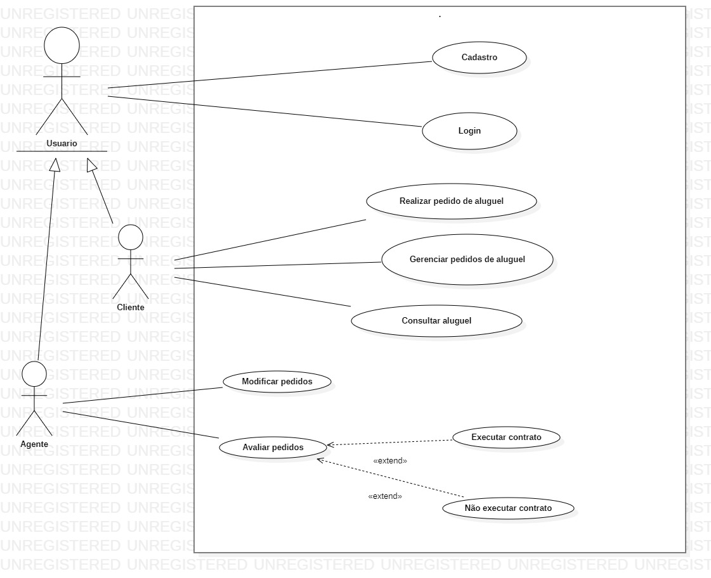

# Diagrama de Casos de Uso

# Histórias de Usuários

### História de Usuário 1: Cadastro

#### Descrição :

Como um novo usuário no sistema, desejo ser capaz de me cadastrar no sistema antes de poder utilizá-lo, fornecendo informações como nome, RG, cpf, endereço, profissão, entidades empregadoras e os respectivos rendimentos auferidos, para que eu possa acessar os recursos do sistema

### História de Usuário 2: Realizar pedido de aluguel

#### Descrição :

Como cliente, eu quero ser capaz de introduzir um pedido de aluguel de um veículo no sistema, especificando detalhes como matrícula, ano, marca, modelo e placa do veículo desejado, para que eu possa solicitar o aluguel de um automóvel.

### História de Usuário 3: Modificar Pedido de aluguel

#### Descrição :

Como cliente, eu quero ser capaz de modificar um pedido de aluguel de um veículo no sistema, para que eu possa alterar detalhes no pedido, como datas ou escolhas de automóveis.

### História de Usuário 4: Consultar

#### Descrição :

Como cliente, eu quero ser capaz de verificar pedidos de aluguel anteriores, para que eu consiga verificar o status e os detalhes dos pedidos.

### História de Usuário 6: Associação de Aluguel

#### Descrição :

Como cliente, eu quero ser capaz de associar meu aluguel do veículo com um contrato de crédito concedido por um banco agente, para que eu possa efetuar meus pagamentos conforme o acordo.

### História de Usuário 7: Cancelar pedido de aluguel

#### Descrição :

Como cliente, eu quero ser capaz de cancelar um pedido de aluguel com status existente, caso minha necessidade de aluguel tenha mudado, assim podendo liberar o veículo.

### História de Usuário 8: Avaliação de Pedidos por Agentes

#### Descrição :

Como um agente, desejo ser capaz de acessar os pedidos de alguel feito pelos clientes, para que assim eu possa avaiá-los do ponto de vista financeiro e assim dar minha decisão se eles atendem os critérios para que o contrato possa ser realizado.

### História de Usuário 9: Avaliação de Pedidos por Agentes

#### Descrição :

Como um agente, desejo ser capaz de modificar um pedido de aluguel existente feito por algum cliente, para que eu possa realizar ajustes necessários para garantir que os critérios do contrato sejam atendidos.

# Diagrama de Classes

# Diagrama de Pacotes
